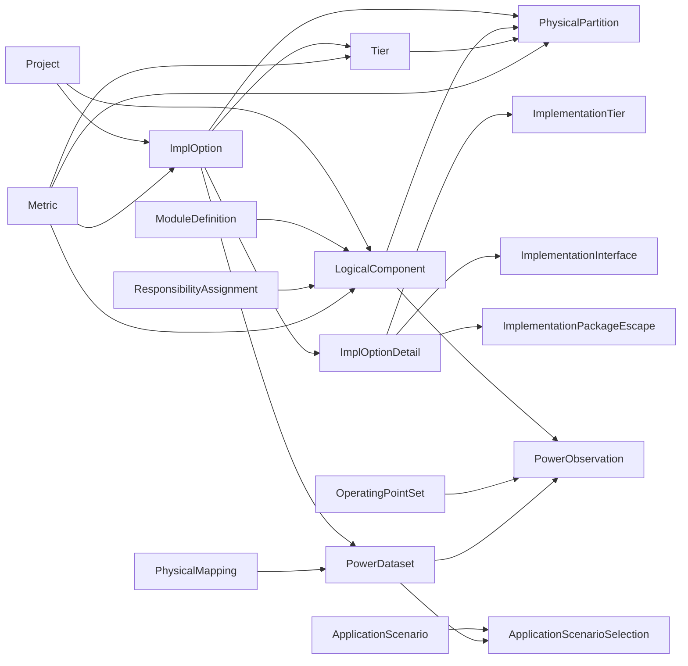

# Schema V7

## Purpose

Schema V7 separates five concerns:

- Reusable module definitions.
- Logical hierarchy and logical instance count.
- Implementation-option-specific physical stack and partition mapping.
- Metrics attached to logical, physical, tier, or implementation-option subjects.
- Application power use case libraries and scenario composition.

The old `scenario_id` physical-implementation concept has been replaced by `impl_option_id`. In the current codebase, `ApplicationScenario` means an application workload scenario for power composition, not a physical implementation option.

## Core Relationship



## Main Tables

### project

Product or chip planning object.

Key fields: `id`, `name`, `product_family`, `generation`, `owner`, `phase`, `description`, `created_at`, `updated_at`.

### impl_option

Physical implementation option under a project, such as monolithic, W2W 3DIC, or 2.5D.

Key fields: `id`, `project_id`, `name`, `impl_type`, `process_combo`, `status`, `description`, `created_at`, `updated_at`.

### module_definition

Reusable IP/module master definition. Use this for what a reusable thing is, not where it appears in the logical hierarchy.

Key fields: `id`, `name`, `module_type`, `ip_owner`, `reuse_class`, `description`.

### logical_component

Logical architecture tree. Repeated modules remain one row with `logical_instance_count`.

Key fields: `id`, `project_id`, `parent_id`, `module_definition_id`, `name`, `instance_type`, `resource_type`, `function_domain`, `hierarchy_path`, `logical_instance_count`, `owner_team`, `visibility_level`, `description`.

Parent residual/self/glue area is not stored as a virtual child row. Store parent total area on the parent, store child total area on each direct child, and derive self/residual area as `parent total - direct child sum`.

### process_node

Process-node capability and area scaling reference.

Key fields: `id`, `foundry`, `node_name`, `logic_density_mtr_per_mm2`, `sram_density_mb_per_mm2`, `logic_area_scale`, `sram_area_scale`, `block_area_scale`, `voltage_nominal`, `cost_factor`, `maturity_level`, `description`.

Logical area metrics use the demo base-process convention. When a physical partition is placed on a tier, the backend scales logic/SRAM/block area with the tier process node's matching scale factor.

### tier

Physical stack tier for one implementation option.

Key fields: `id`, `impl_option_id`, `tier_index`, `name`, `process_id`, `role`, `orientation`, `thickness_um`, `area_limit_mm2`, `description`.

### impl_option_detail

Saved implementation-form definition for one implementation option.

Key fields: `impl_option_id`, `implementation_type`, `status`, `version`, `updated_at`.

Child tables:

- `implementation_tier`: saved tier/die definition rows.
- `implementation_interface`: saved adjacent die-to-die interface rows.
- `implementation_package_escape`: derived bottom-tier package escape parameters.

The backend protects saved details from removing, renaming, or reordering tiers already used by physical partitions.

### physical_partition

Physical carrying of a logical component's own self/residual content in one implementation option.

Key fields: `id`, `impl_option_id`, `logical_component_id`, `tier_id`, `partition_name`, `partition_type`, `resource_category`, `physical_instance_count`, `partition_ratio`, `content_share`, `description`.

Current rules:

- `resource_category` is one of `logic`, `sram`, or `block`.
- Direct rows on a parent component map only that parent's self/residual content, not child modules.
- A zero self/residual area category must not have direct map rows.
- `full` rows always mean `content_share = 1`.
- `partial` rows use `content_share` to describe what fraction of the logical content is carried by that physical piece.
- `partition_ratio` remains only as a compatibility alias for older templates and code paths.
- `instance_share` is computed as `physical_instance_count / logical_instance_count`; it is not stored or manually entered.
- A component is fully mapped only if its own non-zero categories close and every child subtree is fully mapped.

### metric

Unified metric table for non-power facts.

Key fields: `id`, `impl_option_id`, `subject_type`, `subject_id`, `metric_name`, `metric_value`, `metric_unit`, `metric_category`, `value_type`, `corner`, `workload`, `confidence`, `source_note`, `created_at`.

Allowed `subject_type` values include `logical_component`, `physical_partition`, `tier`, and `impl_option`.

Current logical metrics:

- `signal_count_total`
- `logic_area`
- `sram_area`
- `block_area`

Application power is no longer stored as ordinary block or partition metrics. Use `power_observation` and `application_scenario_selection` instead.

### responsibility_assignment

Lightweight team-scoped access/filtering for phase 1. This is not full authentication.

Key fields: `id`, `project_id`, `impl_option_id`, `user_id`, `team_name`, `logical_component_id`, `scope_type`, `can_read`, `can_write`.

`scope_type = subtree` means a team can see the assigned logical component and its descendants. API filtering is available through `?team=...` on component, partition, metric, quality, and import endpoints.

## Application Power Tables

### application_scenario

Application workload scenario for power composition, such as UI browsing, camera 4K60, gaming, or AI burst.

Key fields: `id`, `project_id`, `name`, `category`, `description`.

### power_dataset

Power data baseline or back-annotation set under an implementation option.

In the Application Power workflow, this represents one coherent power data source, not the editable physical partition map. Examples include early architecture estimates, RTL/PTPX simulation snapshots, post-PnR power, and silicon measurement campaigns.

Key fields: `id`, `project_id`, `impl_option_id`, `name`, `dataset_type`, `development_stage`, `source_type`, `confidence`, `dataset_version`, `related_physical_mapping_id`, `description`, `context_json`, `created_at`, `updated_at`.

### physical_mapping

Legacy compatibility storage for old Power Dataset ids.

The old `physicalmapping` table is retained in Phase 1 so existing demo ids and old SQLite databases keep working. Startup compatibility migration copies legacy rows into `powerdataset` when needed. New code should use `PowerDataset` and `/api/power-datasets`; `/api/physical-mappings` remains an API alias.

### operating_point_set

Module-local or shared Profile name for voltage/frequency context.

Key fields: `id`, `project_id`, `name`, `description`, `op_json`.

### power_observation

Module use case/Profile power library and lower-level future power observations.

Key fields: `id`, `project_id`, `impl_option_id`, `physical_mapping_id`, `application_scenario_id`, `operating_point_set_id`, `scope_type`, `scope_id`, `scope_name`, `use_case_name`, `power_value_w`, `statistic_type`, `power_type`, `development_stage`, `confidence`, `is_additive`, `context_json`, `note`.

The current demo stores module use case power under `application_scenario_id = AS_MODULE_LIBRARY`. A unique module power value is keyed by:

```text
impl_option_id + physical_mapping_id + component_id + use_case_name + operating_point_set_id
```

Here `physical_mapping_id` is the compatibility field for the selected Power Dataset id. It points to `powerdataset.id` in new databases.

### application_scenario_selection

Composition rows that choose which module use case/Profile rows participate in one application scenario.

Key fields: `id`, `project_id`, `impl_option_id`, `physical_mapping_id`, `application_scenario_id`, `component_id`, `component_name`, `use_case_name`, `operating_point_set_id`, `included`, `note`.

`included = true` means the row participates in the scenario total. `included = false` may preserve a draft assignment without contributing to the total.

Composition rules:

- Active parent and child rows cannot both be included because that double-counts power.
- Selecting a child should make ancestor included rows inactive.
- Selecting a parent should make descendant included rows inactive.
- Summary power sums only included rows.
- Parent inclusive power may show an `unsplit` explanation when assigned child power is smaller.
- Child assigned power greater than active parent inclusive power is over-specified and should be rejected by save validation.

## Import and Team Input

The canonical workbook is `templates/soc_import_template.xlsx`.

Team-scoped Excel input uses the same SQLite schema and long-table metric format. Team uploads only merge rows inside the assigned logical subtree. The template is an exchange/import format; day-to-day maintenance should happen through the web editors.

## Current Boundaries

Phase 1 intentionally avoids:

- Docker.
- PostgreSQL.
- Alembic migrations.
- Full authentication or complex permission enforcement.
- AI parsing, AI optimization, or automatic partition inference.
- Tier-level and hard-macro-level power decomposition.
