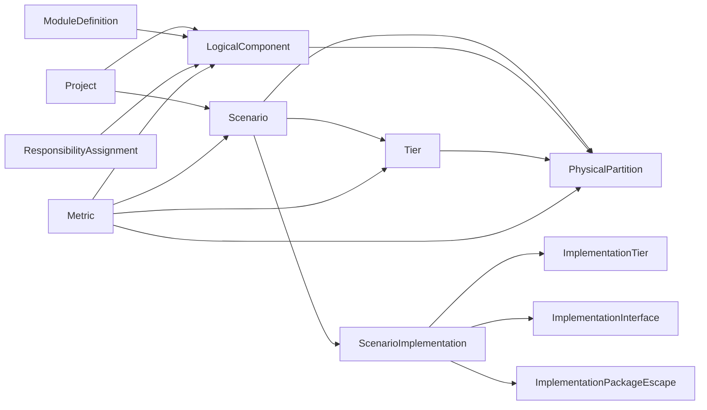

# Schema V7

## Purpose

Schema V7 separates four concerns:

- Reusable module definitions
- Logical hierarchy and logical instance count
- Scenario-specific physical partitioning
- Metrics attached to logical, physical, tier, or scenario subjects

This keeps the logical hierarchy compact while still supporting repeated modules, split implementations across dies, and different physical realization styles.

## Core Relationship

## Tables

### project

Product or chip planning object.

Key fields:

- `id`
- `name`
- `product_family`
- `generation`
- `owner`
- `phase`

### scenario

Architecture or package option under a project.

Examples:

- Monolithic N3E baseline
- 3-tier 3DIC performance option
- Cost-optimized 2.5D option

Key fields:

- `id`
- `project_id`
- `name`
- `scenario_type`
- `process_combo`
- `status`

Scenario is also the owner for implementation-form definition. The frontend `实现方案` page treats each scenario as one implementation option under a project, such as monolithic, 2.5D, or wafer-to-wafer 3DIC.

Implementation-form details are stored separately from physical partitions so a scenario can describe both:

- the stack definition: tier order, names, processes, roles, thicknesses, orientations, and package escape
- the logical-to-physical mapping: physical partition rows attached to logical components and scenario tiers

Because physical partitions reference `tier_id`, changing a saved implementation's tier structure is impact-checked. If any physical partition already uses a tier, the implementation save must not remove/rename that tier or reorder it.

### module_definition

Reusable IP/module master definition.

Use this for "what this reusable thing is", not where it appears in the logical hierarchy.

Key fields:

- `id`
- `name`
- `module_type`
- `ip_owner`
- `reuse_class`

### logical_component

Logical architecture tree. Repeated modules remain one row with `logical_instance_count`.

Example:

`GPU_SHADER_SLICE` appears once with `logical_instance_count = 6`, not six separate logical rows.

Key fields:

- `id`
- `project_id`
- `parent_id`
- `module_definition_id`
- `name`
- `instance_type`
- `resource_type`
- `function_domain`
- `hierarchy_path`
- `logical_instance_count`
- `owner_team`
- `visibility_level`

`owner_team` is used by the phase-1 API for lightweight team-scoped views. It is not a full authentication or permission system.

### tier

Scenario-specific physical stack tier.

Key fields:

- `id`
- `scenario_id`
- `tier_index`
- `name`
- `process_id`
- `role`
- `orientation`
- `thickness_um`
- `area_limit_mm2`

For implementation-definition workflows, tiers are ordered top to bottom within a scenario. A single-layer monolithic scenario can have one tier/die, while a stacked W2W scenario can have multiple ordered tiers.

### process_node

Process-node capability and area scaling reference.

Key fields:

- `id`
- `foundry`
- `node_name`
- `logic_density_mtr_per_mm2`
- `sram_density_mb_per_mm2`
- `logic_area_scale`
- `sram_area_scale`
- `block_area_scale`
- `cost_factor`
- `maturity_level`

Logical component and physical-partition area metrics are stored in the demo base-process area convention. When a physical partition is placed on a tier, the tier's `process_id` selects the process node and the backend multiplies the relevant resource area by the matching scale:

- logic partition area uses `logic_area_scale`
- SRAM partition area uses `sram_area_scale`
- hard/block partition area uses `block_area_scale`

This lets the same logical architecture data be compared across tier/process choices without rewriting the source logical area metrics.

The component detail API exposes `tier_area_distribution` for the selected logical component's subtree. It reports per-tier scaled logic/SRAM/block area and total area after the scenario's physical partitioning is applied.

Phase-1 frontend interface semantics:

- die-to-die orientation uses `Face-to-Face`, `Face-to-Back`, `Back-to-Face`, or `Back-to-Back`
- orientation choices are chained; if one interface uses a die's face/back side, the next interface for the same die must use the opposite side
- HB pitch and TSV pitch are independent quantities
- TSV parameters are side-specific: upper-side TSV and lower-side TSV are separate; `Back-to-Back` can require both
- bottom-die package escape is derived from the final die-to-die orientation; if the bottom die back side faces bumps, a derived `Tn-BUMP` TSV escape must be parameterized separately

### scenario_implementation

One saved implementation-form definition for a scenario.

Key fields:

- `scenario_id`
- `implementation_type`
- `status`
- `version`
- `updated_at`

The version increments on each successful implementation save. This table intentionally stores scenario-level implementation metadata only; detailed rows live in the implementation child tables.

### implementation_tier

Saved tier/die definitions for the scenario implementation.

Key fields:

- `id`
- `scenario_id`
- `tier_id`
- `tier_index`
- `name`
- `process`
- `role`
- `thickness_um`

`tier_id` is the user-facing stable tier key, such as `T0`, `T1`, or `T2`. The backend stores a scenario-prefixed primary key internally, but API payloads use the plain tier key.

### implementation_interface

Saved die-to-die interface definitions between adjacent implementation tiers.

Key fields:

- `id`
- `scenario_id`
- `from_tier_id`
- `to_tier_id`
- `orientation`
- `interconnect`
- `hb_pitch_um`
- `upper_tsv_pitch_um`
- `upper_tsv_keepout_um`
- `lower_tsv_pitch_um`
- `lower_tsv_keepout_um`
- `description`

HB pitch and TSV pitch are independent. Upper-side TSV and lower-side TSV parameters are also independent, including for `Back-to-Back` interfaces.

### implementation_package_escape

Saved derived bottom-tier-to-package-bump TSV escape parameters.

Key fields:

- `scenario_id`
- `bottom_tier_id`
- `requires_tsv`
- `pitch_um`
- `keepout_um`
- `description`

`requires_tsv` is derived from the final die-to-die orientation in the UI. If the bottom die back side faces package bumps, the page represents the package escape as a derived `Tn-BUMP` TSV row and stores its pitch/keep-out here.

### physical_partition

Physical carrying of a logical component in a scenario.

`physical_partition` is scenario-specific by design. A logical component can map to different tiers, counts, or content shares in different implementation scenarios. The tuple of `scenario_id`, `logical_component_id`, and `tier_id` must therefore be interpreted together.

It is also resource-category-specific. Logic, SRAM, and hard/block content can be mapped independently for the same logical component. This avoids forcing one content share to describe heterogeneous resources that may live on different tiers.

Use this table for placement/mapping facts:

- Which scenario
- Which logical component
- Which resource category
- Which tier
- How many physical copies
- What content share is carried by a partial partition

Key fields:

- `id`
- `scenario_id`
- `logical_component_id`
- `tier_id`
- `partition_name`
- `resource_category`
- `partition_type`
- `physical_instance_count`
- `content_share`

The referenced `tier_id` must belong to the same `scenario_id` as the physical partition. API saves validate this directly, and workbook import validation rejects rows where a partition's tier comes from another scenario.

`partition_type` values:

- `full`: a whole logical instance/copy is realized by this partition
- `partial`: one logical module is split across multiple tiers/partitions

`resource_category` values:

- `logic`
- `sram`
- `block`

`block` is also the compatibility category for existing coarse mappings that have not yet been split into logic/SRAM/block-specific rows.

Partition row display and generated naming follow a stable category order:

- `logic`
- `sram`
- `block`

Partition `id` and `partition_name` should be generated by the application instead of manually entered. The generated base is `logicalName_resourceCategory_tier`. `full` rows use that base directly; `partial` rows append a per-resource-category/per-tier partial index such as `_P1`, `_P2`, etc. Multiple partial rows can target the same tier.

`instance_share` is not stored and should not be manually entered. It is computed as `physical_instance_count / logical_instance_count` (both of which are parent-relative).

`content_share` is manually meaningful only for `partial` rows. For `full` rows, `content_share` is always `1`.

Residual parent self/glue logic is not stored as a logical component row. Store parent total metrics on the parent component, store child total metrics on each direct child, and derive residual/self area as `parent total - direct child sum`.

Physical partitions attached directly to a logical component represent only that component's self/residual content. They do not stand in for child modules. For each resource category:

- zero self/residual area means no direct partition rows are allowed
- non-zero self/residual area must close independently by equivalent instance count and by base-area metric
- a parent component is fully mapped only if its own self/residual categories close and all child subtrees close recursively

### responsibility_assignment

Lightweight assignment of a team/user to a logical subtree in a scenario.

Key fields:

- `id`
- `project_id`
- `scenario_id`
- `user_id`
- `team_name`
- `logical_component_id`
- `scope_type`
- `can_read`
- `can_write`

In phase 1, `scope_type = subtree` means a team can see the assigned logical component and its descendants. API filtering is available through `?team=...` on component, physical partition, metric, and quality endpoints.

Team-scoped Excel input uses the same SQLite schema and long-table metric format. The generated team workbook includes shared reference sheets for context, but team uploads only merge:

- `logical_components`
- `physical_partitions`
- `metrics`

The backend validates that these rows remain inside the assigned logical subtree.

### metric

Unified metric table.

Metrics attach to a subject through:

- `subject_type`
- `subject_id`

Allowed `subject_type` values:

- `logical_component`
- `physical_partition`
- `tier`
- `scenario`

Key fields:

- `id`
- `scenario_id`
- `subject_type`
- `subject_id`
- `metric_name`
- `metric_value`
- `metric_unit`
- `metric_category`
- `value_type`
- `corner`
- `workload`
- `confidence`
- `source_note`
- `created_at`

## Metric Naming

Phase-1 logical metrics:

- `signal_count_total`
- `logic_area`
- `sram_area`
- `block_area`
- `power`

Common physical partition metrics:

- `logic_area`
- `sram_area`
- `block_area`
- `power`
- `shape_type`

Tier/scenario metrics:

- `area`
- `power`
- `utilization`

## Closure Rules

For each logical component that has physical partitions in a scenario and resource category:

- `sum(physical_instance_count * content_share)` should equal `logical_instance_count` (both relative to parent)
- `full` partitions always use `content_share = 1`
- `partial` partitions use `content_share` to describe how much of each covered logical instance is carried by that physical piece
- For components with children, physical partitions attached directly to the parent map only the derived residual/self portion.

Frontend maintenance uses the selected scenario as the working context. Switching scenarios changes the available tiers and physical partitions rather than reusing mappings from another scenario.

## Current Demo Data

The seeded demo is `Orion X1 Mobile SoC`.

It includes:

- 36 logical components
- 129 physical partitions, including parent residual/self mappings
- 3 scenarios
- 3 tiers in the 3DIC scenario

Representative multi-instance closure:

- `P_CORE`: logical 4, physical 4
- `E_CORE`: logical 4, physical 4
- `GPU_SHADER_SLICE`: logical 6, physical 6
- `NPU_TENSOR_TILE`: logical 8, physical 8
- `MIPI_PHY`: logical 6, physical 6
