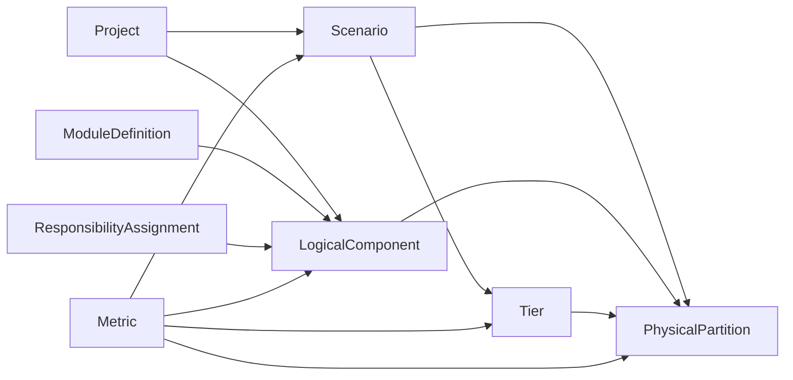

# Schema V7

## Purpose

Schema V7 separates four concerns:

- Reusable module definitions
- Logical hierarchy and logical instance count
- Scenario-specific physical partitioning
- Metrics attached to logical, physical, tier, or scenario subjects

This keeps the logical hierarchy compact while still supporting repeated modules, split implementations across dies, and different physical realization styles.

## Core Relationship

## Tables

### project

Product or chip planning object.

Key fields:

- `id`
- `name`
- `product_family`
- `generation`
- `owner`
- `phase`

### scenario

Architecture or package option under a project.

Examples:

- Monolithic N3E baseline
- 3-tier 3DIC performance option
- Cost-optimized 2.5D option

Key fields:

- `id`
- `project_id`
- `name`
- `scenario_type`
- `process_combo`
- `status`

### module_definition

Reusable IP/module master definition.

Use this for "what this reusable thing is", not where it appears in the logical hierarchy.

Key fields:

- `id`
- `name`
- `module_type`
- `ip_owner`
- `reuse_class`

### logical_component

Logical architecture tree. Repeated modules remain one row with `logical_instance_count`.

Example:

`GPU_SHADER_SLICE` appears once with `logical_instance_count = 6`, not six separate logical rows.

Key fields:

- `id`
- `project_id`
- `parent_id`
- `module_definition_id`
- `name`
- `instance_type`
- `resource_type`
- `function_domain`
- `hierarchy_path`
- `logical_instance_count`
- `owner_team`
- `visibility_level`

`owner_team` is used by the phase-1 API for lightweight team-scoped views. It is not a full authentication or permission system.

### tier

Scenario-specific physical stack tier.

Key fields:

- `id`
- `scenario_id`
- `tier_index`
- `name`
- `process_id`
- `role`
- `orientation`
- `thickness_um`
- `area_limit_mm2`

### physical_partition

Physical carrying of a logical component in a scenario.

Use this table for placement/mapping facts:

- Which scenario
- Which logical component
- Which tier
- How many physical copies
- What logical content ratio

Key fields:

- `id`
- `scenario_id`
- `logical_component_id`
- `tier_id`
- `partition_name`
- `partition_type`
- `physical_instance_count`
- `partition_ratio`

`partition_type` values:

- `full`: a whole logical instance/copy is realized by this partition
- `partial`: one logical module is split across multiple tiers/partitions
- `residual`: parent-level glue/control/interconnect not represented by child rows

### responsibility_assignment

Lightweight assignment of a team/user to a logical subtree in a scenario.

Key fields:

- `id`
- `project_id`
- `scenario_id`
- `user_id`
- `team_name`
- `logical_component_id`
- `scope_type`
- `can_read`
- `can_write`

In phase 1, `scope_type = subtree` means a team can see the assigned logical component and its descendants. API filtering is available through `?team=...` on component, physical partition, metric, and quality endpoints.

### metric

Unified metric table.

Metrics attach to a subject through:

- `subject_type`
- `subject_id`

Allowed `subject_type` values:

- `logical_component`
- `physical_partition`
- `tier`
- `scenario`

Key fields:

- `id`
- `scenario_id`
- `subject_type`
- `subject_id`
- `metric_name`
- `metric_value`
- `metric_unit`
- `metric_category`
- `value_type`
- `corner`
- `workload`
- `confidence`
- `source_note`
- `created_at`

## Metric Naming

Phase-1 logical metrics:

- `signal_count_total`
- `logic_area`
- `sram_area`
- `block_area`
- `power`

Common physical partition metrics:

- `logic_area`
- `sram_area`
- `block_area`
- `power`
- `shape_type`

Tier/scenario metrics:

- `area`
- `power`
- `utilization`

## Closure Rules

For each logical component that has physical partitions in a scenario:

- `sum(partition_ratio)` should be `1.0`
- If all related partitions are `full`, `sum(physical_instance_count)` should equal `logical_instance_count`
- If partitions are `partial`, physical count can represent the same logical instance appearing as multiple physical pieces, so ratio closure is the primary rule

## Current Demo Data

The seeded demo is `Orion X1 Mobile SoC`.

It includes:

- 36 logical components
- 35 physical partitions
- 3 scenarios
- 3 tiers in the 3DIC scenario

Representative multi-instance closure:

- `P_CORE`: logical 4, physical 4
- `E_CORE`: logical 4, physical 4
- `GPU_SHADER_SLICE`: logical 6, physical 6
- `NPU_TENSOR_TILE`: logical 8, physical 8
- `MIPI_PHY`: logical 6, physical 6
